# Устный экзамен по геометрии, 8&nbsp;класс

<!-- ## Хороший сайт с ответами:

[ЯКласс, геометрия, 8 класс](https://www.yaklass.ru/p/geometria/8-klass)

-->

## Содержание

### Определения

- <a href="#mnog">1. Многоугольник</a>
- <a href="#quad_a">2. Четырёхугольник</a>
- <a href="#para">3. Параллелограмм</a>
- <a href="#trap">4. Трапеция</a>
- <a href="#trap_eq">5. Равнобедренная трапеция</a>
- <a href="#trap_sq">6. Прямоугольная трапеция</a>
- <a href="#romb">7. Ромб</a>
- <a href="#quad">8. Квадрат</a>
- <a href="#rect">9. Прямоугольник</a>
- <a href="#tri_sim">10. Подобные треугольники</a>
- <a href="#prop">11. Пропорциональные отрезки</a>
- <a href="#shod">12. Сходственные стороны</a>
- <a href="#podob">13. Коэффициент подобия</a>
- <a href="#sred">14. Средняя линия треугольника</a>
- <a href="#sin_cos">15. Синус, косинус, тангенс острого угла в ПТ</a>
- <a href="#kas">16. Касательная</a>
- <a href="#cen_vpis">17. Центральный угол, вписанный угол</a>
- <a href="#vpis">18. Вписанная окружность</a>
- <a href="#opis">19. Описанная окружность</a>

### Знать и доказать

- <a href="#doc_para">1. Свойства и признаки параллелограмма</a>
- <a href="#doc_fales">2. Теорема Фалеса</a>
- <a href="#doc_rect">3. Свойства и признаки прямоугольника</a>
- <a href="#doc_quad">4. Свойства квадрата</a>
- <a href="#doc_squares">5. Свойства площадей (без доказательства)</a>
- <a href="#doc_sq_form">6. Формула площади прямоугольника, треугольника (все известные), параллелограмма, ромба, трапеции</a>
- <a href="#doc_sq_eq_a">7. Теорема об отношении площадей Т, имеющих равные углы</a>
- <a href="#doc_pyth">8. Теорема Пифагора</a>
- <a href="#doc_pyth_rev">9. Обратная теорема Пифагора</a>
- <a href="#doc_sq_sim">10. Теорема об отношении площадей подобных Т</a>
- <a href="#doc_sim">11. Признаки подобия Т</a>
- <a href="#doc_midline">12. Теорема о средней линии Т</a>
- <a href="#doc_medi">13. Свойства медианы Т</a>
- <a href="#doc_prop">14. Пропорциональные отрезки в ПТ</a>
- <a href="#doc_trgon">15. Доказательство основного тригонометрического тождества</a>
- <a href="#doc_sin_cos">16. Значения синуса, косинуса и тангенса 30°, 45° и 60°</a>
- <a href="#doc_line_circ">17. Взаимное расположение прямой и окружности</a>
- <a href="#doc_kas">18. Свойства и признаки касательной</a>
- <a href="#doc_vpis_a">19. Теорема о вписанном угле и её следствие</a>
- <a href="#doc_chord">20. Свойства хорд</a>
- <a href="#doc_bisect">21. Свойства биссектрисы угла и срединного препендикуляра, следствие</a>
- <a href="#doc_height">22. Теорема о пересечении высот, четыре замечательные точки</a>
- <a href="#doc_vpis_opis">23. Теорема о вписанной и описанной окружности Т</a>
- <a href="#doc_vo_quad">24. Сваойства вписанного и описанного четырёхугольника</a>

## Определения

#### 1. Многоугольник

__Многоугольник__ – это фигура, состоящая из нескольких точек (больше двух)
и соответствующего количества отрезков, которые их последовательно соединяют.
Эти точки называются вершинами многоугольника, а отрезки – сторонами.

__Свойства__:

1. Сумма углов выпуклого многоугольника равна (n-2)·180°.
2. Сумма внешних углов ВМ равна 360°.

#### 2. Четырёхугольник

__Четырехугольником__ — это фигура, которая состоит из четырех точек 
и четырех последовательно соединяющих их отрезков. 
При этом никакие три из данных точек не лежат на одной прямой,
а соединяющие их отрезки не пересекаются. Две несмежные стороны 
четырехугольника называются противоположными.

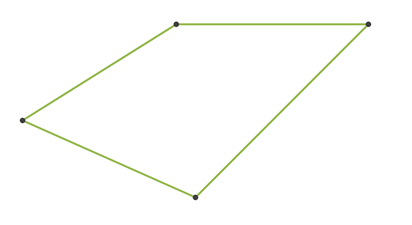

__Свойства__:

1. Сумма углов выпуклого ЧУ равна 360°.

#### 3. Параллелограмм

__Параллелограмм__ – это четырехугольник, противоположные стороны которого равны и параллельны.

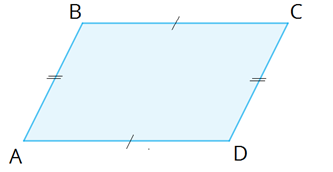

#### 4. Трапеция

__Трапеция__ – это четырёхугольник, у которого две противоположные стороны параллельны
и обязательно не равны (потому что в этом случае фигура будет являться параллелограммом).

#### 5. Равнобедренная трапеция

__Равнобедренная трапеция__ — это трапеция, у которой боковые стороны равны, а основания — параллельны.

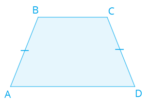

#### 6. Прямоугольная трапеция

__Прямоугольная трапеция__ — это трапеция, у которой одна боковая сторона перпендикулярна основаниям.

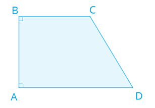

#### 7. Ромб

__Ромб__ – это параллелограмм, все стороны которого равны.

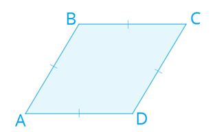

#### 8. Квадрат

__Квадрат__ — это прямоугольник, у которого все стороны равны.
Квадрат можно считать ромбом с прямыми углами.

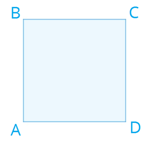

#### 9. Прямоугольник

__Прямоугольник__ — это параллелограмм, у которого все углы прямые.

#### 10. Подобные треугольники

__Подобные треугольники__ — треугольники, у которых соответствующие углы равны, а соответствующие стороны пропорциональны.

#### 11. Пропорциональные отрезки

Если отношение отрезков `a` и `b` равно отношению отрезков `c` и `d`, т. е. `a / b` = `c / d` , 
то такие пары отрезков называются __пропорциональными__.

#### 12. Сходственные стороны

__Сходственные стороны__ подобных треугольников — это стороны, лежащие напротив равных углов.

#### 13. Коэффициент подобия

__Коэффициент подобия__ – это число, равное отношению сходственных сторон в подобных фигурах.

Для предыдущего рисунка: `k = AB/DE = BC/EF = CA/FD`

#### 14. Средняя линия треугольника

__Средняя линия треугольника__ — это отрезок, соединяющий середины двух сторон треугольника.
Средняя линия треугольника параллельна одной из его сторон и равна половине этой стороны.

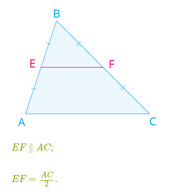

#### 15. Синус, косинус, тангенс острого угла в ПТ

В прямоугольном треугольнике: 

- __Синус__ — это отношение противолежащего катета к гипотенузе;
- __Косинус__ — это отношение прилежащего катета к гипотенузе;
- __Тангенс__ — это отношение противолежащего катета к прилежащему.

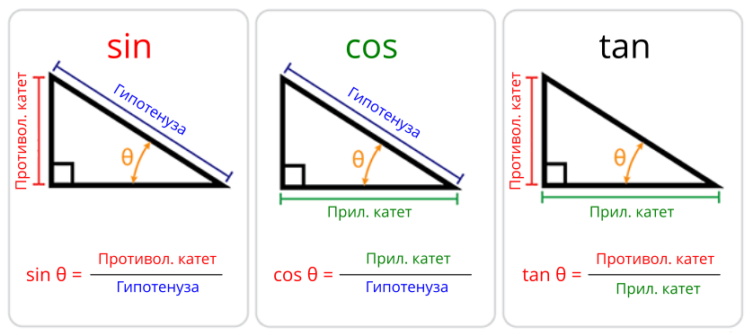

#### 16. Касательная

Касательная к окружности — это прямая, имеющая с окружностью только одну общую точку.

#### 17. Центральный угол, вписанный угол

- __Центральный угол__ — это угол, вершина которого лежит в центре окружности.
- __Вписанный угол__ — это угол, вершина которого лежит на окружности.

#### 18. Вписанная окружность

__Вписанная окружность__ – это окружность, лежащая внутри многоугольника и касающаяся всех его __сторон__.

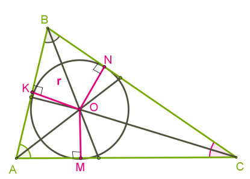

#### 19. Описанная окружность

__Описанная окружность__ — это окружность, проходящая через все __вершины__ многоугольника.

----

## Знать и доказать

#### 1. Свойства и признаки параллелограмма

__Свойства__:

1. Противоположные стороны параллелограмма равны.
2. Противоположные углы параллелограмма равны.
3. Диагонали параллелограмма точкой их пересечения делятся пополам.
4. Диагональ делит параллелограмм на два равных треугольника.
5. Сумма углов, прилежащих к одной стороне параллелограмма, равна 180°.
6. Накрест лежащие углы при диагонали равны.

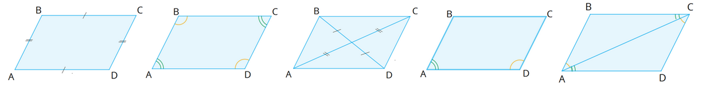

__Признаки__:

1. Четырёхугольник является параллелограммом, если две его стороны параллельны и равны.
2. Четырёхугольник является параллелограммом, если его противоположные стороны попарно равны.
3. Четырёхугольник является параллелограммом, если его диагонали пересекаются 
   и точкой пересечения делятся пополам.

#### 2. Теорема Фалеса

*Смотри учебник, страница 105.*

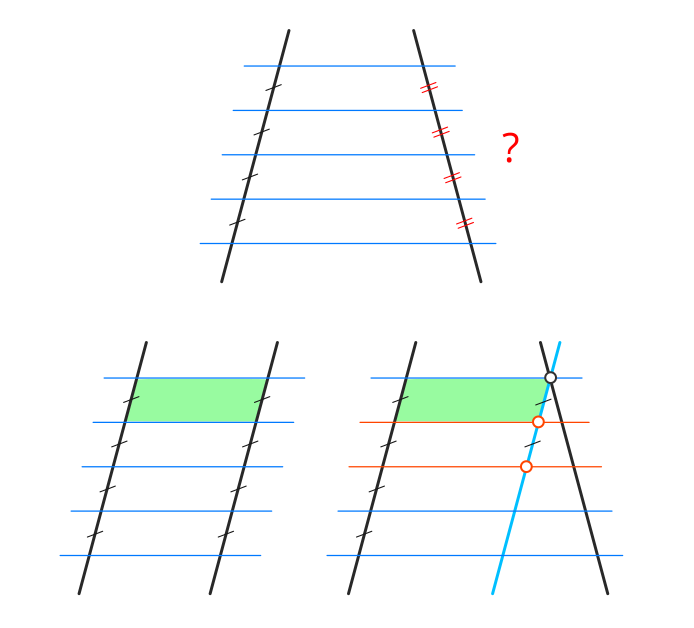

#### 3. Свойства и признаки прямоугольника

Прямоугольник — это ПГ, у которого все углы прямые.

__Свойства__:

1. Диагонали прямоугольника равны. Доказательство: по двум ПТ с равными катетами.

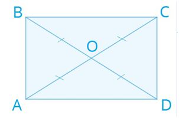

__Признаки__:

1. Если диагонали в параллелограмме равны, то ПГ — прямоугольник. Доказательство:
два треугольника, составляющие ПГ равны по трём сторонам ⇒ равны соседние углы A и D ПГ.
2. Противоположные углы в ПГ равны ⇒ все углы равны ⇒ углы составляют 360° / 4 = 90°.

#### 4. Свойства квадрата

Квадратом называется прямоугольник, у которого все стороны равны.

__Свойства__:

1. Все углы Квадрата прямые. (По определению прямоугольника.)
2. Диагонали квадрата равны и взаимно перпендикулярны.
3. Диагонали квадрата делят углы пополам.

#### 5. Свойства площадей (без доказательства)

1. Равные многоугольники имеют равные площади.
2. Площадь многоугольника равна сумме площадей многоугольников из которых он состоит.
3. Площадь квадрата равна квадрату его стороны `S = a²`.

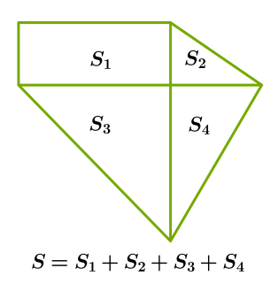

#### 6. Формула площади прямоугольника, треугольника (все известные), 
                                  параллелограмма, ромба, трапеции

- Sпрямоугольника = AD·BE. __Доказательство__: `(a + b)² = a² + b² + 2·(a·b)`.
- Sтреугольника = 1/2·a·h. __Доказательство__: через SПГ; 
  диагональ делит ПГ пополам.
  
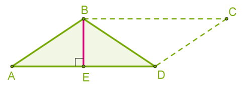

- Sпрямоуг. треугольника = 1/2·a·b, где a и b - катеты.

- ; 

- SПГ = AD·BE. __Доказательство__: треугольники, образованные от наложения 
  прямоугольника BC·BE на ПГ равны, по углу и двум сторонам ⇒ равны их площади ⇒
  площади прямоугольника и ПГ равны.

- Sромба = SПГ = 1/2·d₁·d₂. __Доказательство__: через равные треугольники.

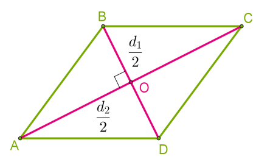

- Sтрапеции = 1/2·BE·(AD + BC). __Доказательство__: как сумма двух треугольников.

#### 7. Теорема об отношении площадей Т, имеющих равные углы

__Если угол одного треугольника равен углу другого треугольника, 
то площади этих треугольников относятся как произведения сторон, заключающих равные углы.__

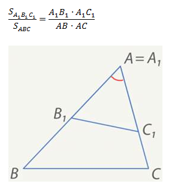

__Доказательство__:

1. S / SA₁B₁C = AB / A₁B₁, так как Т. ABC и Т. A₁B₁C имеют общую высоту, опущенную из С.
2. SA₁B₁C / SA₁B₁C₁ = AC / A₁C₁, так как Т. A₁B₁C и Т. A₁B₁C₁ имеют общую высоту, опущенную из B₁.
3. Перемножив оба равенства получим: S / SA₁B₁C₁ = AB·AC / (A₁B₁·A₁C₁).

Теорема доказана.

#### 8. Теорема Пифагора

<!-- __a² + b² = c²__ -->

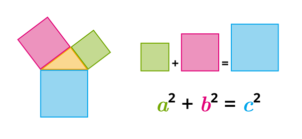

__Доказательство__:

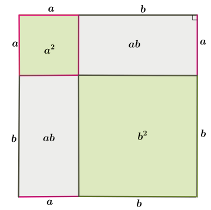

1. Квадрат со стороной (a + b) будет состоять из четырёх ПТ abc с общей площадью 4·1/2·a·b = 2·a·b
   и квадрата со стороной с. 
2. Также квадрат со стороной (a + b) будет состоять из 1) квадрата со стороной a, 
   2) квадрата со стороной b и 3) двух прямоугольников со сторонами ab и общей площадью 2·a·b.
3. Из этих двух представлений следует, что площадь квадрата со стороной c равна сумме площадей
   квадратов со сторонами a и b.
   
Теорема доказана.

#### 9. Обратная теорема Пифагора

__Если квадрат одной стороны треугольника равен сумме квадратов длин двух других сторон, 
то такой треугольник прямоугольный.__

__Доказательство__:

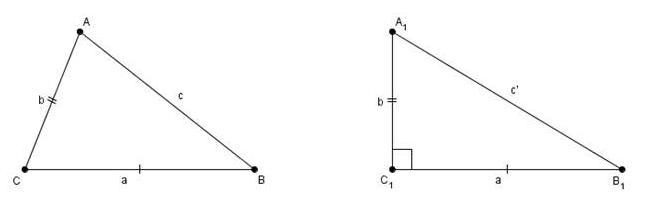

1. По условию a² + b² = c².
2. Рассмотрим другой, прямоугольный треугольник со сторонами abc'. По теореме Пифагора
   a² + b² = (c')² ⇒ c = c' ⇒ треугольники равны по трём сторонам.

Теорема доказана.

#### 10. Теорема об отношении площадей подобных Т

__Отношение площадей двух подобных треугольников равно квадрату коэффициента подобия.__

__Доказательство__:

1. По теореме об отношении площадей Т, имеющих равные углы: S/S₁ = AB·AC&nbsp;/&nbsp;(A₁B₁·A₁C₁).
2. Коэффициент подобия равен k = AB/A₁B₁ = AC/A₁C₁ ⇒  S/S₁ = k².

Теорема доказана.

#### 11. Признаки подобия Т

1. __По двум равным углам: если два угла одного Т равны двум углам другого Т, то такие Т подобны.__

   __Доказательство__: 
   
   1. Пусть в треугольниках ABC и A₁B₁C₁ углы ∠A = ∠A₁, ∠B = ∠B₁. Угол ∠С также
   будет равен углу ∠C₁, так как сумма угло любого Т равна 180°. 
   2. SABC&nbsp;/&nbsp;SA₁B₁C₁ = AB·AC&nbsp;/&nbsp;(A₁B₁·A₁C₁) 
      = CA·CB&nbsp;/&nbsp;(C₁A₁·C₁B₁) = BA·BC&nbsp;/&nbsp;(B₁A₁·B₁C₁), по теореме об отношении площадей.
   3. Из (2) следует, что AB/A₁B₁ = BC/B₁C₁ = CA/C₁A₁ ⇒ Т ABC ∾ A₁B₁C₁.

2. __По двум пропорциональным сторонам и углу между ними: если две стороны одного Т пропорциональны
   двум сторонам другого Т и углы, заключённые между этими сторонами, равны, то такие Т подобны.__
   
   __Доказательство__: 
   
   1. Пусть для треугольников ABC и A₁B₁C₁ отношение AB/A₁B₁ = AC/A₁C₁ и 
   ∠A = ∠A₁. 
   2. Построим третий Т ABC₂, такой, что ∠BAC₂ = ∠C₁A₁B₁ и ∠ABC₂ = ∠A₁B₁C₁.
   3. По первому признаку подобия Т (по двум углам), Т A₁B₁C₁ ∾ Т ABC₂ ⇒ AB/A₁B₁ = AC₂/B₁C₁.
   4. Сравнивая равенства из (1) и (3) получаем, что AC = AC₂, откуда следует, что Т ABC и ABC₂
   равны (по двум сторонам и углу между ними), а Т ABC ∾ A₁B₁C₁.
   
3. __По трём сторонам: если три стороны одного Т пропорциональны трём сторонам другого Т, то такие
   Т подобны.__
   
   __Доказательство__: 
   
   1. Пусть треугольники ABC и A₁B₁C₁ пропорциональны ⇒ AB/A₁B₁ = BC/B₁C₁ = CA/C₁A₁.
   2. Построим третий Т ABC₂, такой, что ∠BAC₂ = ∠C₁A₁B₁ и ∠ABC₂ = ∠A₁B₁C₁. 
   3. По первому признаку
   подобия Т (по двум углам), Т A₁B₁C₁ ∾ Т ABC₂ ⇒ AB/A₁B₁ = BC₂/B₁C₁ = C₂A/C₁A₁. 
   4. Сравнивая равенства из (1) и (3) получаем, что BC = BC₂ и CA = C₂A ⇒ Т ABC равен Т ABC₂ 
   по трём сторонам, а Т ABC ∾ A₁B₁C₁.

*Смотри учебник, страница 142.*

#### 12. Теорема о средней линии Т

__Средняя линия треугольника параллельна одной из его сторон и равна половине этой стороны.__

__Доказательство__:

1. Т BMN и BAC подобны по второму признаку (по двум пропорц. сторонам и углу между ними) ⇒
   сходственные стороны пропорциональны, а углы равны.
2. Так как MB/AB = 1/2, то коэффициент подобия Т k = 1/2 ⇒ MN/AC = 1/2.
3. Так как ∠BAC = ∠BMN, то MN || AC.

Теорема доказана.

#### 13. Свойства медианы Т

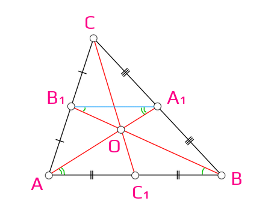

1. __Точкой пересечения медианы делятся в отношении 2 к 1.__

   __Доказательство__:
   
   1. Проведём линию A₁B₁, которая будет являться средней линией треугольника, так как медианы
      делят стороны пополам.
   2. ∠OB₁A₁ = ∠OBA, ∠B₁A₁O = ∠BAO как накрест лежащие, образованные двумя параллельными линиями
      AB || A₁B₁ и медианами, пересекающимися в точке O.
   3. Следовательно Т ABO ∾ Т A₁B₁O по первому признаку подобия (по двум равным углам), а так как
      AB/A₁B₁ = 2, коэффициент пропорциональности k = 2, что означает, что AO/A₁O = BO/B₁O = 2:1.
   4. Таким образом, точка O делит медианы в отношении 2:1.
   5. Аналогично доказывается соотношение AO/A₁O = CO/C₁O.

2. __Все три медианы треугольника пересекаются в одной точке.__

   __Доказательство__:
   
   1. Из того, что любые две медианы делятся точкой их пересечения в отношении 2:1 следует,
      что точка пересечения всех трёх медиан совпадает.

3. __Медиана разбивает треугольник на два равновеликих (по площади) треугольника.__

   __Доказательство__:
   
   1. Проведём высоту CH в треугольнике ABC.
   2. Площадь Т ACC₁ равна 1/2·AC₁·CH, а площадь Т CC₁B равна 1/2·C₁B·CH.
   3. Так как медиана делит сторону пополам, то AC₁ = C₁B ⇒ площади двух треугольников,
      образованных медианой равны.

4. __Треугольник делится тремя медианами на шесть равновеликих треугольников.__

   __Доказательство__:
   
   1. SAOC₁ = SOC₁B по общей высоте и равным основаниям.
   2. SAA₁B = SAB₁B оп общему основанию и равным высотам,
      так как AB || A₁B₁.
   3. SAOB₁ = SBOA₁, так как эти площади являются остатками от
      вычитания площади Т AOB из треугольников AA₁B и AB₁B, чьи площади равны.
   4. Точно также SAOС₁ = SСOA₁.
   5. Отсюда можно сделать вывод, что SAOС₁ = SBOA₁ и что
      все 6 треугольников равны по площади.

5. __В прямоугольном треугольнике медиана, проведённая из вершины с прямым углом,
   равняется половине гипотенузы.__
   
   __Доказательство__:
   
   1. Достроим ПТ до прямоугольника. Гипотенуза ПТ является одной из диагоналей прямоугольника.
   2. Медиана будет являться половиной второй диагонали прямоугольника, так как делит первую
      диагональ пополам.
   3. Отсюда следует, что медиана будет равна половине гипотенузы.

#### 14. Пропорциональные отрезки в ПТ

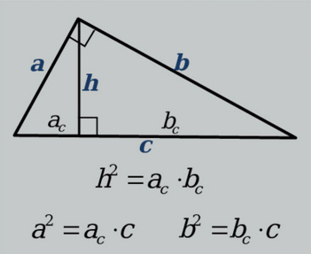

__Высота ПТ, проведённая из прямого угла делит Т на два подобных исходному.__

__Доказательство__:

1. Высота пересекается с основанием под прямым углом ⇒ два новых треугольника прямоугольные.
2. Оба новых треугольника кроме прямого угла также имеют ещё по одному равному углу с исходным.
3. Согласно первому признаку подобия треугольников (по двум углам), новые треугольники подобны
   исходному.

__Пропорциональные отрезки__:

1. __Высота ПТ, проведённая из прямого угла есть среднее пропорциональное для отрезков, 
   на которые делится гипотенуза этой высотой.__
   
   __Доказательство__:
   
   1. Для подобных треугольников будут равны отношения сходственных сторон: 
      bc/h = h/ac ⇒ h² = ac·bc.

2. __Катет ПТ есть среднее пропорциональное для гипотенузы и отрезка гипотенузы, заключённого
   между катетом и высотой, проведённой из прямого угла.__

   __Доказательство__:

   1. Точно также, из отношений сходственных сторон подобных треугольников следует
      c/b = b/bc ⇒ b² = bc·c;
   2. c/a = a/ac ⇒ a² = ac·c.

#### 15. Доказательство основного тригонометрического тождества

__sin²A + cos²A = 1__

__Доказательство__:

1. Отложим из центра окружности радиусом 1 (единичной окружности) угол α от горизонтальной линии.
2. Опустим перпендикуляр из точки пересечения линии построения угла и окружности на горизонтальную линию.
3. Из определений синуса и косинуса следует, что катеты получившегося ПТ примут значения
   a/1 = sinα, b/1 = cosα.
4. По теореме Пифагора: sin²α + cos²α = 1² = 1.

Тождество доказано.

#### 16. Значения синуса, косинуса и тангенса 30°, 45° и 60°

1. __Катет, лежащий напротив угла 30° равен половине гипотенузы.__

   __Доказательство__:
   
   1. Отразив ПТ вдоль длинного катета получим второй, симметричный ПТ со смежным углом 30°.
   2. Сумма смежных углов двух ПТ равна 60°, а их общий длинный катет представляет собой
      высоту объединённого треугольника, делящего его основание пополам.
   3. Так как сумма углов треугольника равна 180°, то в каждом из входящих в объединённый
      треугольник ПТ второй угол будет равен 60° ⇒ все углы объединённого треугольника равны 60°.
   4. Следовательно, объединённый треугольник является равносторонним с длиной стороны равной
      длине гипотенузы исходного треугольника.
   5. Так как высота треугольника делит основание пополам, меньший катет исходного треугольника
      будет равен половине гипотенузы, т.е. a/c = 1/2 = __√1/2__ = sin30° = cos60°.

2. __Отношение катета к гипотенузе в равнобедренном ПТ равно √2/2 = 1/√2__

   __Доказательство__:
   
   1. Диагональ квадрата делит его на два равнобедренных ПТ, с острыми углами = 45°.
   2. Гипотенуза РБПТ равна c = √(a²+a²) = √(2·a²) = a·√2, по теореме Пифагора.
   3. sin45° = cos45° = a/с = 1/√2; домножив числитель и знаменатель на √2 получим значение __√2/2__.

3. __Отношение катета, лежащего напротив угла 60° к гипотенузе равно √3/2.__

   __Доказательство__:

   1. В ПТ с углами 30° и 90° третий угол равен 60°.
   2. По теореме Пифагора найдём длину катета лежащего напротив угла 60°, приняв длину
      гипотенузы равной 1: длина короткого катета будет равна 1/2 ⇒ x = √(1²-1/2²) = √(4/4 - 1/4)
      = √(3/4) = __√3/2__ = sin60° = cos30°.

Сведём полученные значения в таблицу.

|sin   |cos   |Значение  |
|------|------|----------|
|sin30°|cos60°|__√1/2__ = 1/2|
|sin45°|cos45°|__√2/2__ = 1/√2|
|sin60°|cos30°|__√3/2__|

Значения тангенса вычисляются как отношения синуса к косинусу: tanα = sinα/cosα.

#### 17. Взаимное расположение прямой и окружности

1. Если расстояние от центра окружности до прямой < r, то прямая и окружность имеют
   две общие точки. Прямая называется __секущей__.
2. Если расстояние от центра окружности до прямой = r, то прямая и окружность имеют
   только одну общую точку. Прямая называется __касательной__.
3. Если расстояние от центра окружности до прямой > r, то прямая и окружность не имеют
   общих точек.

#### 18. Свойства и признаки касательной

1. __Касательная и радиус, проведённый в точку касания перпендикулярны.__

   __Доказательство__:

   1. Перпендикуляр является наикратчайшим расстоянием от точки до прямой.
   2. Если бы радиус, проведённый к точке касания не был перпендикулярен прямой,
      то существовала бы такая точка, где расстояние от прямой до центра окружности
      было бы < r — это расстояние и было бы перпендикуляром.
   3. В случае, если расстояние до прямой < r, прямая и окружность имеют две общие точки,
      что противоречит определению касательной.
   4. Так как окружноть и касательная имеют лишь одну общую точку, то радиус, проведённый
      к этой точке и будет кратчайшим и, следовательно, будет перпендикулярен прямой.

2. __Отрезки касательных, проведённых из одной точки, равны и составляют равные углы к прямой,
   проведённой через эту точку и центр окружности.__

   

   __Доказательство__:
   
   1. Треугольники AOB и AOC равны, так как являются прямоугольными, имеют общую гипотенузу
      и по одному одинаковому катету, являющемуся радиусом окружности.
   2. А раз треугольники равны, то равны и все их стороны и углы.

3. __Если прямая проходит через конец радиуса и перпендикуляра ему, то такая прямая является
   касательно к окружности.__
   
   __Доказательство__:
   
   1. Расстояние от центра окружности до прямой является перпендикуляром и = r.
   2. Следовательно прямая и окружность имеют лишь одну общую точку ⇒ прямая является касательной.

#### 19. Теорема о вписанном угле и её следствие

__Вписанный угол измеряется половиной дуги, на которую он опирается.__

__Доказательство__:

Рассмотрим три случая.

1. Один из лучей вписанного угла проходит через центр окружности. В этом случае угол ∠AOC, 
   равный дуге AC, является внешним углом равнобедренного треугольника ABO и углы ∠1 и ∠2 
   равны ⇒ ∠AOC = ∠1 + ∠2 = 2·∠1 ⇒ ∠ABC = 1/2 дуги AC.
2. Луч, проведённый через вершину угла и центр окружности делит угол на две части.
   Данный луч пересекает дугу AC в точке D. Из (1) следует, что дуга ∠ABD = 1/2 дуги AD,
   ∠DBC = 1/2 дуги DC ⇒ ∠ABC = 1/2·(дуга AD + дуга DC) = 1/2 дуги AC.
3. Луч, проведённый через вершину угла и центр окружности не входит в угол. В этом случае
   доказательство аналогично (2) за тем исключением, что вместо суммы дуг AD и DC берётся их
   разница: ∠ABC = 1/2·(дуга AD - дуга DC) = 1/2 дуги AC.

Теорема доказана.

__Следствия__:

1. Вписанные углы, опирающиеся на одну и туже дугу равны.
2. Вписанный угол, опирающийся на полуокружность, — прямой.

#### 20. Свойство хорд

__Если две хорды пересекаются, то произведение отрезков одной хорды равно произведению 
отрезков другой. AE·BE = CE·DE__

__Доказательство__:

1. В треугольниках ADE и CBE углы ∠3 и ∠4 равны как вертикальные.
2. Углы ∠1 и ∠2 тоже равны как вписанные, опирающиеся на одну дугу.
3. По первому признаку подобия треугольников (по двум углам) следует, что Т ADE ∾ Т CBE.
4. Следовательно, AE/CE = DE/BE. ⇒ AE·BE = CE·DE.

Теорема доказана.

#### 21. Свойство биссектрисы угла и срединного перпендикуляра, следствия

1. __Каждая точка биссектрисы неразвёрнутого угла равноудалена от его сторон.__

    

   __Доказательство__:
   
   1. Проведём перпендикуляры к сторонам угла из произвольной точки M, лежащей на биссектрисе.
   2. Образованные ПТ AKM и ALM будут равны, что следует из их общей гипотенузы и равных углов ∠1 и ∠2.
   3. Следовательно MK = ML.
   
   __Следствия__:
   
   1. Геометрическим местом точек, равноудалённых от сторон неразвёрнутого угла, является биссектриса.
   2. Биссектрисы треугольника пересекаются в одной точке.
   
2. __Каждая точка СП равноудалена от концов отрезка.__

   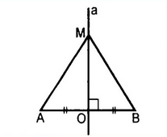
   
   __Доказательство__:
   
   1. Выберем точку M на СП и проведём от неё отрезки MA и MB.
   2. Получившиеся ПТ будут равны, по двум катетам, ⇒ равны и их гипотенузы.
   
   __Следствия__:
   
   1. Геометрическим местом точек, равноудалённых от концов отрезка, является СП.
   2. СП, проведённые к сторонам треугольника пересекаются в одной точке.

#### 22. Теорема о пересечении высот Т, четыре замечательные точки

__Высоты треугольника пересекаются в одной точке.__

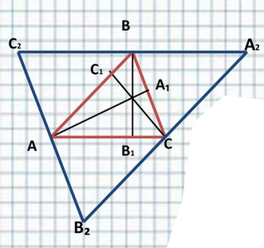

__Доказательство__:

1. Проведём через каждую вершину треугольника прямую, параллельную противоположной стороне.
2. Точки A, B и C будут делить стороны Т A₂B₂С₂ пополам.
3. Следовательно, высоты Т ABC будут являться СП сторон Т A₂B₂С₂ ⇒ они пересекаются в одной точке.

Теорема доказана.

__4 замечательные точки__:

1. Точка пересечения медиан.
2. Точка пересечения биссектрис.
3. Точка пересечения СП.
3. Точка пересечения высот.

#### 23. Теорема о вписанной и описанной окружности Т

1. __В любой треугольник можно вписать окружность.__

   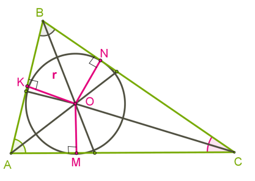

   __Доказательство__:
   
   1. Так как точка пересечения биссектрис углов Т равноудалена от сторон Т, то через
      точки пересечения сторон Т и перпендикляров, опущенных из точки пересечения биссектрис
      на стороны, можно провести окружность с центром в ТПБ.
   2. Такая окружность является вписанной.

   Теорема доказана.

2. __Около любого треугольника можно описать окружность.__

   

   __Доказательство__:

   1. Так как точка пересечения срединных перпендикуляров сторон Т равноудалена от
      вершин Т, через вершины этого Т можно провести окружность с центром в точке пересечения СП.
   2. Такая окружность является описанной.

   Теорема доказана.

#### 24. Свойства описанного около окружности и вписанного в окружность четырёхугольника

1. __Свойства описанного ЧУ__:

   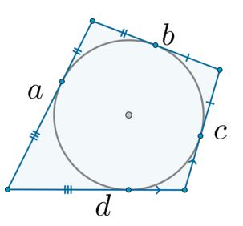

   1. В любом описанном ЧУ суммы противоположных сторон равны: a + c = b + d. 
      Это свойство легко установить из рисунка.
   2. Если суммы противоположных сторон ЧУ равны, то в него можно вписать окружность.
   
2. __Свойства вписанного ЧУ__:

   

   1. В любом вписанном ЧУ сумма противоположных углов равна 180°. __Доказательство__:
      Из теоремы о вписанном угле следует, что ∠B = 1/2 дуги ADC, а ∠D = 1/2 дуги ABC.
      Так как суммы дуг составляют 360°, то суммы углов будут составлять 1/2·360° = 180°.
   2. Если сумма противоположных углов ЧУ равна 180°, то около такого ЧУ можно описать окружность.
   
----

## Задачи главы VI 

*Учебник геометрии 7,8,9 классов Анатасяна Л.С., Бутузова В.Ф., 2022, синяя обложка с ромбиками.*

#### 461. ✅ Смежные стороны параллелограмма равны 12 и 14 см, острый угол ПГ = 30°. Найти площадь ПГ.

__Решение__:

1. Так как острый угол равен 30°, то высота ПГ будет равна 1/2 его стороны.
2. Площадь ПГ равна произведения основания на высоту и, в нашем случае, равна 1/2·12·14 = 84 см².

__Ответ__:

Площадт ПГ равна 84 см².

#### 463. ✅ Сторона ПГ равна 8.1 см, а диагональ, равная 14 см, образует с ней угол 30°. Найти площадь ПГ.

__Решение__:

1. Высота ПГ будет равна 1/2·14 = 7 см.
2. Площадь ПГ равна произведения основания на высоту = 7·8.1 = 56.7 см².

__Ответ__:

Площадь ПГ равна 56.7 см².

#### 466. ✅ Диагональ ПГ равна его стороне, один из углов — 45°, а бо́льшая сторона = 15.2 см.
          Найти площадь ПГ.

__Решение__:

1. Если диагональ ПГ равна его стороне, а острый угол ПГ равен 45°, то такая диагональ
   будет также являться высотой ПГ, а его длинная сторона будет гипотенузой равнобедренного ПТ,
   образованного диагональю и стороной.
2. Длинная сторона ПГ будет также являться диагональю квадрата, равновеликого ПГ.
2. Площадь квадрата есть квадрат его диагонали, делённый пополам ⇒ S = 15.2²/2 = 115.52 см².

__Ответ__:

Площадт ПГ равна 115.52 см².

#### 477. ✅ Найти диагонали ромба, если одна из них в 1.5 раза больше другой, а площадь ромба равна 27 см².

__Решение__:

1. S = 1/2·a·b.
2. b = 3/2·a.
3. 27 = 1/2·a·3/2·a; a² = 27·4 / 3 = 9·4; a = 3·2 = 6 см.
4. b = 3/2·6 = 9 см.

__Ответ__:

Диагонали ромба равны 6 см и 9 см.

#### 482. ✅

#### 487. ✅

#### 493. ✅

#### 496. ✅ Сложная!

Надо составить уравнение.

### Дополнительные задачи главы VI

#### 516. ✅ Сложная!

1. Через высоту BD.
2. Через теорему об отношении площадей Т, имеющих равные углы и AMC.

#### 518. ✅ Сложная!

i) Лёгкая.
ii) Через √2.

#### 526. ❌ Нереальная!

1. Через подобные треугольнки, образованные от деления ромба его высотой 
   через точку пересечения диагоналей.
2. Через 2 формулы площади треугольника найти неизвестную диагональ.

Неправильный ответ в учебнике? Мой ответ для обоих решений: 2·√2/√5.

#### 527. ✅

## Задачи главы VII

#### 545. 

#### 544. 

#### 548. 

#### 559. 

#### 560. 

#### 575. 

#### 576. 

#### 577. 

#### 593. 

#### 601. 

### Дополнительные задачи главы VII

#### 607. 

## Задачи главы VIII

#### 638. 

#### 641. 

#### 652. 

#### 656. 

#### 657. 

#### 678. 

#### 681. 

#### 692. 

#### 693. 

#### 694. 

#### 699. 

#### 702. 

#### 705. 
